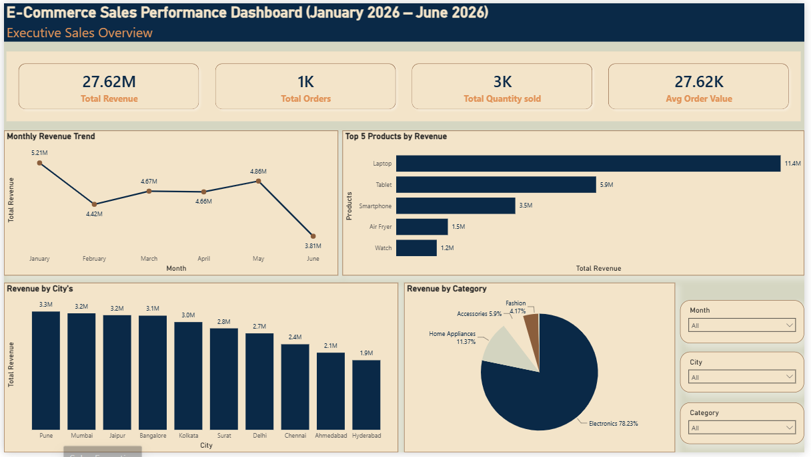
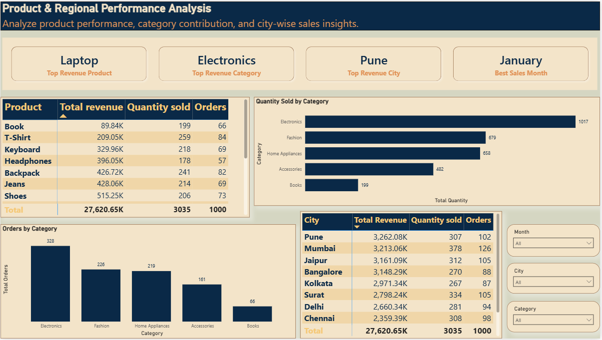
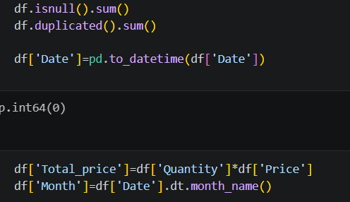
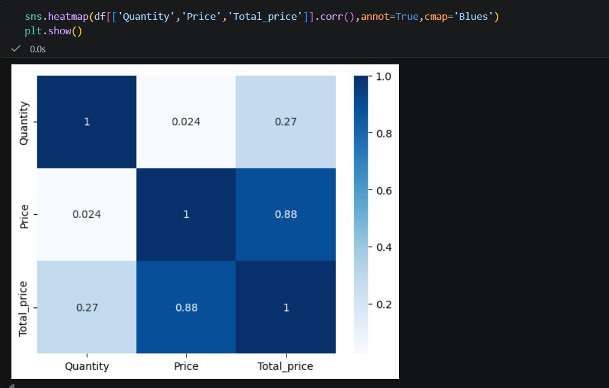
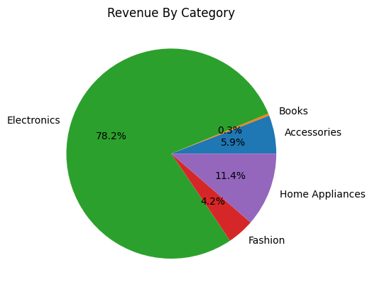
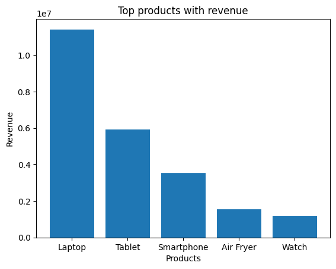
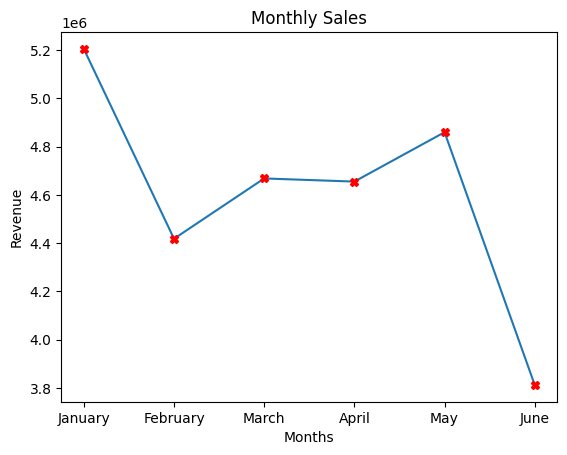
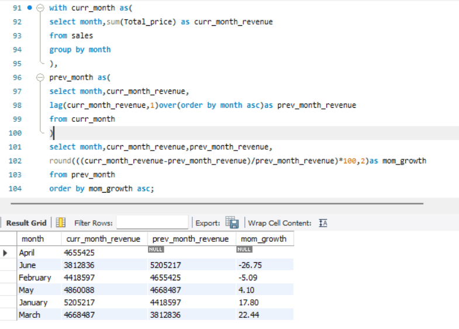
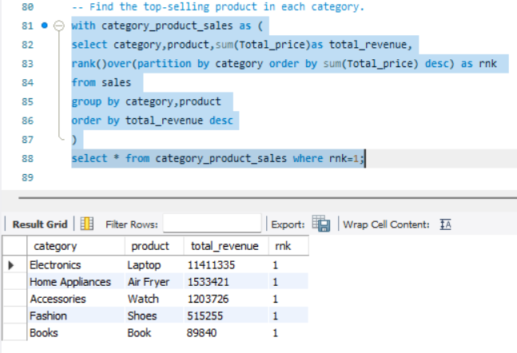

# E-Commerce Sales Performance Analysis

A end-to-end business intelligence project analyzing 1,000 simulated e-commerce transactions (Jan–Jun 2026) using **Python**, **SQL**, and **Power BI** — turning scattered transaction data into an executive-ready reporting system.



---

## 📁 Table of Contents
- [Project Overview](#project-overview)
- [Dataset](#dataset)
- [Business Problem](#business-problem)
- [Tools & Skills Used](#tools--skills-used)
- [Key Business Questions](#key-business-questions)
- [Dashboards](#dashboards)
- [Python Analysis](#python-analysis)
- [SQL Analysis](#sql-analysis)
- [Key Insights](#key-insights)
- [Recommendations](#recommendations)
- [Repository Structure](#repository-structure)
- [How to Use](#how-to-use)

---

## Project Overview

An e-commerce company experienced rapid sales growth in H1 2026 but had no centralized way to track performance. This project cleans, analyzes, and visualizes six months of transaction data to answer core business questions — revenue drivers, top products, regional performance, and monthly trends — through Python EDA, SQL aggregation/window functions, and interactive Power BI dashboards.

## Dataset

1,000 simulated e-commerce transactions (Jan 2026 – Jun 2026) with the following fields:

| Field | Description |
|---|---|
| `Order_ID` | Unique identifier for each order |
| `Product` | Name of the purchased product |
| `Category` | Product category |
| `Quantity` | Number of units purchased |
| `Price` | Price per unit |
| `City` | Customer's city |
| `Date` | Order date |

## Business Problem

Sales data was scattered across transactions with no centralized reporting, making it hard for management to answer:
- Which categories/products drive the most revenue?
- Which cities are driving growth?
- How do sales trends change month to month?
- What are the overall revenue and order volume figures?

**Objective:** Transform raw transaction data into actionable insights via Python, SQL, and Power BI dashboards covering revenue trends, product/category performance, and regional distribution.

## Tools & Skills Used

| Tool | Purpose |
|---|---|
| **Python** (pandas, seaborn, matplotlib) | Data cleaning, feature engineering, EDA, correlation analysis, KPI generation, charting |
| **SQL** (CTEs, window functions) | Revenue aggregation, month-over-month growth, cumulative revenue, top-N and ranking queries |
| **Power BI** | Interactive dashboards with Month/City/Category slicers |

## Key Business Questions

| # | Question | Answer |
|---|---|---|
| 1 | Total revenue generated? | **₹27.62M** |
| 2 | Total orders placed? | **1,000** |
| 3 | Highest revenue category? | **Electronics — 78.2%** |
| 4 | Top 5 revenue products? | Laptop, Tablet, Smartphone, Air Fryer, Watch (~88% of revenue) |
| 5 | Top revenue cities? | Pune, Mumbai, Jaipur, Bangalore (₹3.1M–3.3M each) |
| 6 | Monthly revenue trend? | Peaked in Jan (₹5.21M), fell 22% May→June (₹3.81M) |
| 7 | Total quantity sold? | **3,035 units** |
| 8 | Categories needing improvement? | Books (0.3% of revenue), Fashion (4.2% despite high order volume) |

## Dashboards

**Executive Sales Overview** — total revenue, orders, monthly trend, top products, revenue by city and category, with Month/City/Category slicers.


**Product & Regional Performance Analysis** — product, category, and city-level breakdown.



## Python Analysis

**1. Data Cleaning & Feature Engineering** - Helps in data validation before analysis


**2. Correlation Analysis** — tests whether revenue is driven by price or quantity.


| Pair | Correlation | Meaning |
|---|---|---|
| Price ↔ Total_price | **0.88** | Strong — price drives revenue |
| Quantity ↔ Total_price | 0.27 | Weak — volume barely matters |
| Quantity ↔ Price | 0.024 | None |

**3. KPI Generation & Charts**
Ecommerce_Online_Sales_Analysis/images/kpis.png

Ecommerce_Online_Sales_Analysis/images/data_visualization.png

| Revenue by Category | Top 5 Products | Monthly Trend |
|---|---|---|
|  |  |  |

## SQL Analysis

**Month-over-Month Revenue Growth** -Hepls in understanding monthly growth



**Best-Selling Product per Category** - Gets best selling product from each category


| Category | Top Product | Revenue |
|---|---|---|
| Electronics | Laptop | 11,411,335 |
| Home Appliances | Air Fryer | 1,533,421 |
| Accessories | Watch | 1,203,726 |
| Fashion | Shoes | 515,255 |
| Books | Book | 89,840 |

*(Additional queries — top 5 products, category contribution % — in [`Ecommerce_Online_Sales_Analysis/SQL/sales_analysis.sql`](sql/))*

## Key Insights

- 🔹 **Revenue is price-driven, not volume-driven.** Electronics is 33% of orders/units but 78% of revenue.
- 🔻 **June revenue dropped 22%** from May — the sharpest decline of the period, needs investigation.
- ⚠️ **Concentration risk:** Top 5 products = ~88% of revenue; Laptop alone = ~41%.
- 📦 **Fashion & Accessories** move volume but contribute <10% of revenue combined.
- 📍 **Hyderabad & Ahmedabad** trail top cities by 35–40% — untapped growth opportunity.

## Recommendations

1. Investigate the June (and February) revenue declines before Q3 planning.
2. Reduce dependency on the top 5 SKUs by promoting mid-tier products.
3. Bundle low-AOV categories (Fashion, Accessories) with high-ticket Electronics.
4. Audit and invest in underperforming cities (Hyderabad, Ahmedabad).
5. Reassess the Books category's ROI given its 0.3% revenue share.
6. Track revenue-per-order and high-value SKU conversion, not just unit volume.
7. Store dates as proper `DATE` types (not text) to fix SQL window-function ordering.

## Repository Structure

```
ecommerce-sales-analysis/
├── README.md
├── data/
│   └── sales_data.csv
├── notebooks/
│   └── eda_analysis.ipynb
├── sql/
│   └── analysis_queries.sql
├── images/
│   └── executive_dashboard.png
├── powerbi/
│   └── sales_dashboard.pbix
└── reports/
    ├── Ecommerce_Executive_Report.pdf
    ├── Ecommerce_Executive_Report.docx
    ├── Ecommerce_Executive_Deck.pdf
    └── Ecommerce_Executive_Deck.pptx
```

## How to Use
Clone the repo: https://github.com/Gayatrik04/Ecommerce_sales_analysis.git
---

#LinkedIn:- https://www.linkedin.com/in/gayatri-kasbekar-674a883a3/
#GitHub:- https://github.com/Gayatrik04


