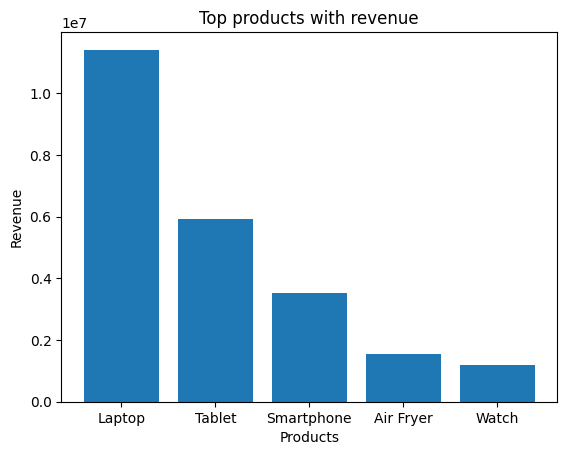
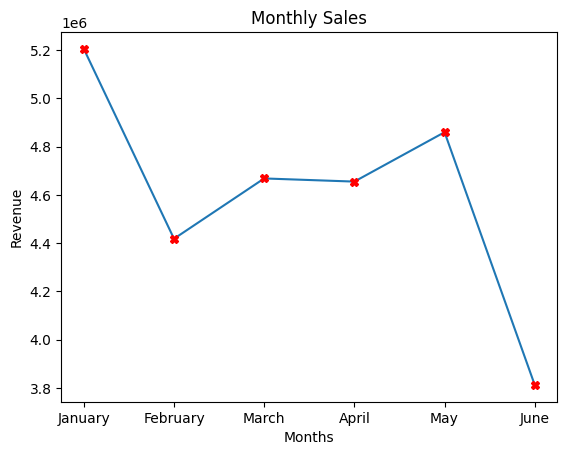
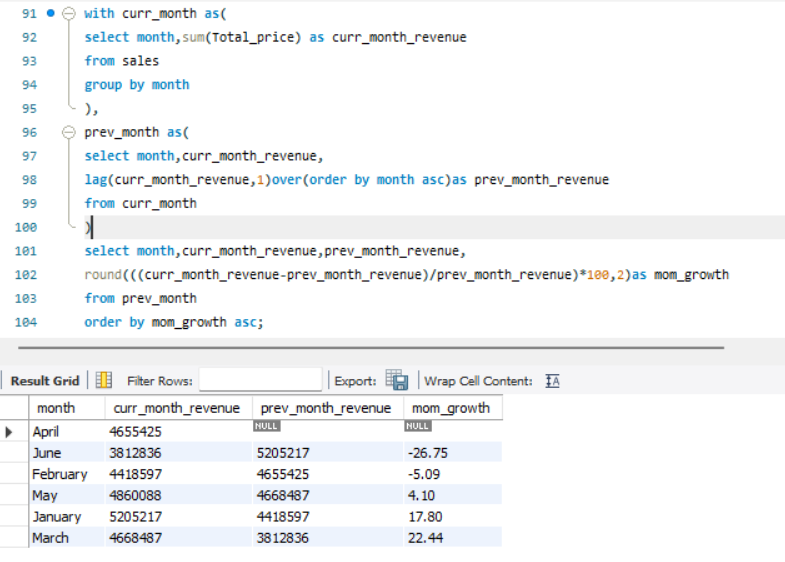
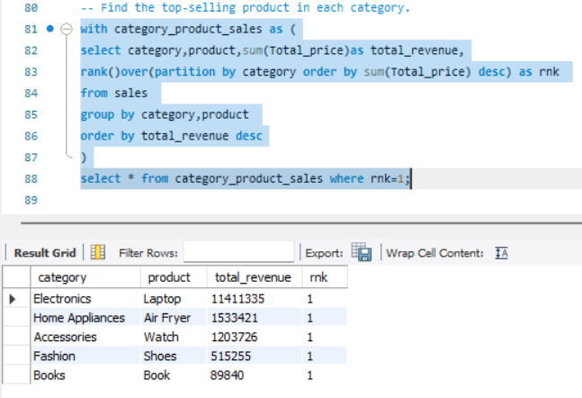
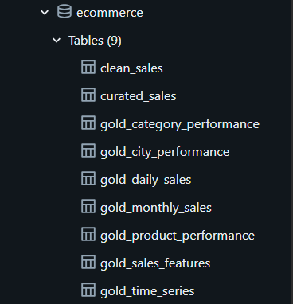
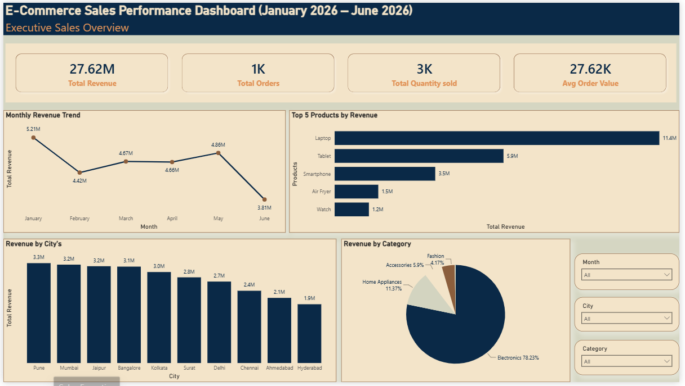
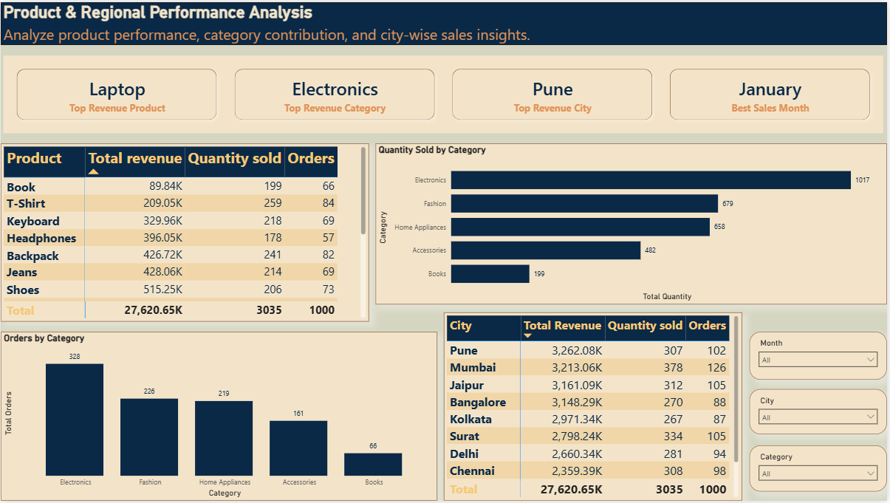

# E-Commerce Sales Performance Analysis  & Revenue Forecasting

An end-to-end data analytics and machine learning project analyzing e-commerce sales data from January to June 2026.

The project combines **Python, SQL, Databricks, Machine Learning, and Power BI** to transform raw transaction data into business insights and short-term revenue forecasts.

---

## 📌 Project Overview

The objective of this project is to understand e-commerce sales performance, identify key revenue drivers, analyze product and geographic trends, and build a machine learning model to forecast short-term daily revenue.

The project follows an end-to-end workflow:

**Raw Sales Data → Python Cleaning → EDA → SQL Analysis → Databricks Lakehouse → Feature Engineering → Machine Learning → Revenue Forecast → Power BI**

### Business Question

> How can historical sales data be used to understand business performance and forecast short-term revenue for better sales and operational planning?

---

## 📊 Dataset

The dataset contains **1,000 simulated e-commerce orders** covering January 2026 to June 2026.

| Field | Description |
|---|---|
| `Order_ID` | Unique identifier for each order |
| `Product` | Purchased product |
| `Category` | Product category |
| `Quantity` | Number of units purchased |
| `Price` | Price per unit |
| `City` | Order/customer city |
| `Date` | Order date |

### Dataset KPIs

| KPI | Value |
|---|---:|
| Total Orders | **1,000** |
| Total Units Sold | **3,035** |
| Total Revenue | **₹27.62M** |
| Average Order Value | **₹27,620.65** |
| Average Selling Price | **₹8,940.49** |
| Analysis Period | **Jan–Jun 2026** |

---

## 🎯 Business Problem

The business had transaction-level sales data but no centralized analytical workflow for understanding:

- Revenue performance
- Product and category contribution
- Geographic performance
- Monthly sales trends
- Revenue concentration
- Short-term future revenue

### Objectives

- Clean and validate sales data.
- Analyze revenue, orders, units, products, categories, and cities.
- Build reusable SQL analytics.
- Implement a Databricks Lakehouse pipeline.
- Create daily sales and time-series features.
- Compare multiple forecasting models.
- Generate a 7-day future revenue forecast.
- Provide business insights through Power BI and analytical reports.

---
# 🛠️ Tools & Technologies

| Technology | Purpose |
|---|---|
| **Python** | Data cleaning, EDA, feature engineering |
| **Pandas / NumPy** | Data manipulation and numerical analysis |
| **Matplotlib / Seaborn** | Data visualization |
| **MySQL** | Relational data analysis |
| **SQL** | KPI, ranking, aggregation and time-series analysis |
| **Databricks** | Lakehouse data processing and Gold-layer analytics |
| **Scikit-learn** | Machine learning and forecasting |
| **Power BI** | Interactive business dashboards |
| **VS Code / Jupyter** | Development and ML workflow |
| **Git / GitHub** | Version control |

---

# 🏗️ End-to-End Architecture

```text
                    RAW E-COMMERCE DATA
                            │
                            ▼
                  Python / Pandas Cleaning
                            │
                            ▼
                           EDA
                            │
              ┌─────────────┴─────────────┐
              │                           │
              ▼                           ▼
           MySQL                    Databricks
                                      Lakehouse
                                          │
                                          ▼
                                     clean_sales
                                          │
                                          ▼
                                    curated_sales
                                          │
                                          ▼
                                  Gold Analytics
                                          │
             ┌────────────────────────────┼────────────────────────┐
             │                            │                        │
             ▼                            ▼                        ▼
      Product Analysis            Category Analysis       Geographic Analysis
             │
             ▼
       gold_daily_sales
             │
             ▼
      gold_sales_features
             │
             ▼
     Time-Series Features
             │
             ▼
       Machine Learning
             │
       ┌─────┼──────────┐
       ▼     ▼          ▼
    Baseline Linear   Random Forest
             Regression
       │     │          │
       └─────┼──────────┘
             ▼
      Model Evaluation
             │
             ▼
       Best Model Selected
        Random Forest
             │
             ▼
      7-Day Revenue Forecast
             │
             ▼
        Power BI / Reports

```

---
# Python Analysis
1. Data Cleaning & Validation
Python/Pandas was used to:
- Inspect the dataset.
- Validate data types.
- Check missing values.
- Identify duplicate records.
- Standardize data.
- Create calculated sales metrics.
- Prepare the dataset for SQL and Databricks analysis.


2. Exploratory Data Analysis
EDA was performed to understand:
- Revenue distribution
- Product performance
- Category contribution
- Monthly sales trends
- Geographic performance
- Price and quantity relationships


3. KPI Generation & Visual Analysis

## 3. KPI Generation & Visual Analysis


| Revenue by Category | Top 5 Products | Monthly Trend |
|:-------------------:|:--------------:|:-------------:|
|  |  |  |

---

# 🗄️ SQL Analysis

SQL was used to perform business-focused analysis, including:

- Revenue aggregation
- Product and category performance
- Geographic analysis
- Month-over-month revenue growth
- Cumulative revenue analysis
- Ranking and Top-N analysis
- Window functions
- Advanced business analysis

---

## 📈 Month-over-Month Revenue Growth

SQL window functions were used to calculate monthly revenue, previous-month revenue, and month-over-month growth to identify periods of growth and decline.



---

## 🏆 Best-Selling Product by Category

SQL ranking and aggregation were used to identify the highest-revenue product within each category.



| Category | Top Product | Revenue |
|:---|:---|---:|
| Electronics | Laptop | ₹11,411,335 |
| Home Appliances | Air Fryer | ₹1,533,421 |
| Accessories | Watch | ₹1,203,726 |
| Fashion | Shoes | ₹515,255 |
| Books | Book | ₹89,840 |

### Key Finding

**Laptop** was the highest-revenue product overall, while **Electronics** was the strongest category. The analysis helps identify category leaders and products contributing the most revenue.

---

## 🧱 Databricks Lakehouse

Databricks was used to build the analytical data layer for the e-commerce sales pipeline.

### Data Flow

```text
Clean Sales Data
      ↓
curated_sales
      ↓
Gold Analytical Tables
      ↓
Business Analysis + Forecasting
```

### Key Work

- Created `curated_sales` to clean and standardize transaction-level sales data.
- Built Gold tables for monthly, product, category, city, and time-series analysis.
- Created `gold_daily_sales` for daily revenue, orders, units, AOV, and average selling price.
- Created `gold_sales_features` with lag and rolling revenue features for revenue forecasting.
- Used Databricks SQL and Delta tables to prepare reusable datasets for Power BI and machine learning.



---

# 🤖 Machine Learning — Revenue Forecasting

## Forecasting Objective

The ML component was developed to answer:

> **Can historical sales patterns and calendar features be used to forecast future daily revenue?**

### Features Used

**Calendar Features**
- Day
- Day of week
- Week
- Month
- Quarter
- Weekend indicator

**Historical Revenue Features**
- 1-day lag
- 7-day lag
- 14-day lag
- 30-day lag

**Rolling Revenue Features**
- 7-day rolling average
- 14-day rolling average
- 30-day rolling average

Rolling features were calculated using previous observations to prevent target leakage.

---

## 📊 Time-Series Dataset

The Databricks `gold_sales_features` table contains **180 consecutive daily observations**.

After removing rows without sufficient historical information, **150 ML-ready observations** were available.

A chronological train-test split was used because this is a time-series forecasting problem.

| Dataset | Rows | Period |
|:---|---:|:---|
| Training | **120** | Jan 31 – May 30, 2026 |
| Testing | **30** | May 31 – Jun 29, 2026 |

---

## 📈 Models Compared

Three approaches were evaluated:

1. **Previous-Day Baseline** — uses the previous day's revenue as the prediction.
2. **Linear Regression** — uses calendar and historical revenue features to predict daily revenue.
3. **Random Forest Regressor** — captures nonlinear relationships between historical sales patterns and revenue.

---

## 🏆 Model Performance


### Selected Model: Random Forest

Random Forest achieved the lowest MAE, RMSE, and MAPE among the evaluated models.

Compared with the previous-day baseline:

- **MAE improved by approximately 24.3%**
- **RMSE improved by approximately 32.5%**

MAPE is treated as a supplementary metric because low-revenue days can produce very large percentage errors.

---

## 🔍 Feature Importance

The Random Forest model relied most heavily on historical revenue and calendar features.

Top features included:

1. `day`
2. `revenue_rolling_30`
3. `revenue_lag_14`
4. `revenue_rolling_14`
5. `revenue_lag_7`
6. `revenue_rolling_7`
7. `revenue_lag_1`
8. `revenue_lag_30`

Feature importance indicates model reliance on a feature and does not imply causation.

---

## 🔮 7-Day Revenue Forecast

The selected Random Forest model was retrained using all **150 ML-ready observations** and used to generate a recursive 7-day revenue forecast.


### Forecast Summary

| Metric | Value |
|:---|---:|
| **7-Day Expected Revenue** | **₹1,267,344.24** |
| **Average Daily Forecast** | **₹181,049.18** |
| **Highest Forecast** | **₹312,523.78** |
| **Lowest Forecast** | **₹97,034.30** |

The forecast shows higher predicted revenue at the beginning of the forecast period, followed by lower predicted revenue toward the weekend.

---

# Key Business Insights
1. **Revenue is highly concentrated**
Electronics contributes approximately 78.2% of total revenue.
The top five products contribute approximately 88% of revenue, with the Laptop contributing approximately 41%.
Business implication:
The business should closely monitor high-revenue products because supply or performance issues in these products could significantly affect overall revenue.
2. **Revenue declined from May to June**
June revenue decreased by approximately 22% compared with May.
Business implication:
The decline should be investigated by product, category, city, and sales period to identify the underlying drivers.
3. **Revenue is more strongly associated with price than quantity**
The correlation between Price and Total Price was 0.88, while Quantity and Total Price showed a weaker correlation of 0.27.
Business implication:
High-value products have a major impact on overall revenue, so revenue analysis should consider product value in addition to unit volume.
4. **Historical sales patterns support short-term forecasting**
The Random Forest model gave substantial importance to lagged and rolling revenue features.
Business implication:
Recent sales history can provide useful signals for short-term revenue monitoring and operational planning.
5. **Forecasting can support short-term planning**
The 7-day forecast provides a near-term estimate of expected revenue.
Potential applications include:
- Inventory planning
- Sales target planning
- Revenue monitoring
- Promotional planning
- Operational planning

---

# 📊 Power BI Dashboards

Power BI was used to build interactive dashboards for executive reporting and detailed sales performance analysis.

## Executive Sales Overview

The executive dashboard provides a high-level view of:

- Total Revenue
- Total Orders
- Total Units
- Monthly Revenue Trend
- Top Products
- Revenue by Category
- Revenue by City
- Interactive Month, City, and Category filters



---

## Sales & Regional Performance

The second dashboard provides detailed analysis of:

- Product performance
- Category performance
- Regional and city-level revenue
- Sales distribution across locations
- Interactive filters for business analysis




---

# 💡 Recommendations

1. Investigate the **June revenue decline** to understand the factors behind the slowdown.
2. Monitor inventory and sales performance of **high-revenue products**, especially top Electronics products.
3. Reduce dependency on a small number of top products by promoting **mid-tier products**.
4. Investigate **underperforming cities** to identify potential growth opportunities.
5. Review low-contribution categories such as **Books and Fashion**.
6. Evaluate revenue using **orders, units, AOV, and product-level contribution** rather than unit volume alone.
7. Use the **7-day revenue forecast as a planning input**, not as a guaranteed revenue target.

---

# 📁 Repository Structure

```text
Ecommerce_sales_analysis/
│
├── README.md
├── data/
│
├── databricks/
│   └── ecommerce_sales_sql_analysis.dbquery.ipynb
│
├── ml/
│   ├── 01_sales_forecasting.ipynb
│   └── output/
│       ├── 7_day_sales_forecast.csv
│       ├── 7_day_sales_forecast.png
│       ├── model_comparison.csv
│       └── feature_importance.csv
│
├── notebook/
│   ├── 01_data_quality.ipynb
│   ├── 02_data_cleaning.ipynb
│   ├── 03_eda.ipynb
│   └── 04_business_analysis.ipynb
│
├── sql/
│   ├── 01_schema.sql
│   ├── 02_data_quality.sql
│   ├── 03_sales_kpis.sql
│   ├── 04_product_analysis.sql
│   ├── 05_category_analysis.sql
│   ├── 06_geographic_analysis.sql
│   ├── 07_time_series_analysis.sql
│   └── 08_advanced_analysis.sql
│
├── images/
├── powerBi/
└── reports/
```

---

# 🚀 Key Project Outcomes

- Analyzed **1,000 e-commerce orders**, **3,035 units**, and approximately **₹27.62M revenue**.
- Performed data cleaning, validation, and exploratory analysis using **Python**.
- Conducted business analysis using **SQL aggregations, CTEs, and window functions**.
- Built a **Databricks Lakehouse** with curated and Gold analytical tables.
- Created leakage-safe **lag and rolling revenue features** for forecasting.
- Compared a previous-day baseline, **Linear Regression**, and **Random Forest**.
- Selected **Random Forest** based on chronological test-set performance.
- Achieved **₹92K MAE** and **₹108.8K RMSE** on the test set.
- Generated a **7-day recursive revenue forecast**.
- Built interactive **Power BI dashboards** for executive and regional sales analysis.

---

# 🎯 Business Value

The project demonstrates an end-to-end analytics workflow:

**Data → Cleaning → EDA → SQL → Databricks → Feature Engineering → Machine Learning → Forecasting → Business Insights → Power BI**

The analysis helps identify **revenue trends, top-performing products and categories, geographic performance, and short-term revenue expectations** to support business planning.

---

# 📎 How to Use

Clone the repository:

```bash
git clone https://github.com/Gayatrik04/Ecommerce_sales_analysis.git
```

Open the project in **VS Code** or **Jupyter Notebook**.

### ML Forecasting

```text
ml/01_sales_forecasting.ipynb
```

### Databricks Analysis

```text
databricks/ecommerce_sales_sql_analysis.dbquery.ipynb
```

### SQL Analysis

```text
sql/
```

---

## 👩‍💻 Author

**Gayatri Sunil Kasbekar**

[LinkedIn](https://www.linkedin.com/in/gayatri-kasbekar-674a883a3/)

[GitHub](https://github.com/Gayatrik04)


